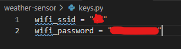

# Tutorial: Building your own IoT weather sensor with Node JS

*By Johan Ronnås, jr22rbr*

This project consists of a temperature sensor and a humidity sensor which will monitor weather conditions. The data is sent to a Node JS server and presented on a simple website using HTML, CSS and javascript. 

The project is primarily built on Python and Node JS using http requests for communication. Depending on your proficiency in javascript which will make up most of the code this project will take around one to two days to complete.

## Objective

As more and more devices are getting "smarter" there are already many weather stations available with online functionality (se for example [this one](https://www.kjell.com/se/produkter/hem-fritid/termometrar-hygrometrar/tradlosa-termometrar/netatmo-weather-station-smart-vaderstation-p51615)). These devices come with their own dashboards and interfaces for viewing the collected weather data. However, by building our own custom device we get full control of how the data is stored and presented, giving us the opportunity to view the statistics that we are interested in. We also have the opportunity to expand the weather station with other components and sensors as we see fit. 

The objective of this project is to be a kind of proof-of-concept. It's main objective is to be a learning experience of setting up the LoPy4 device as well as writing a Node JS server handling the data. By writing our own server we can get a good understanding of all the different steps and aspects involved in IoT: measuring the data, transmitting it from a device, handling the request, storing data in a database and finally presenting it to the user. As such the focus will be on using alternatives that are simple to use and understand, giving us control of the configuration as opposed to ready made solutions with more functionality.


Device name | Description | Price | Link to buy
------------ | -------------| -------------| -------------
LoPy4 | Microcontroller | 393 kr | https://pycom.io/product/lopy4/
Expansion board | Allows for USB connection | 180 kr | https://pycom.io/product/expansion-board-3-0/
DHT11 module | Digital temperature and humidity sensor | 49 kr | https://www.electrokit.com/produkt/digital-temperatur-och-fuktsensor-dht11/ 
Breadboard | Allows for easy connections using jumper wires | 59 kr | https://www.electrokit.com/produkt/kopplingsdack-400-anslutningar/
Jumper wires | For connecting components |29 kr | https://www.electrokit.com/en/product/jumper-wires-1-pin-male-male-150mm-10-pack/
Micro USB cable | For connecting the LoPy to the computer | 39 kr | https://www.electrokit.com/en/product/usb-cable-a-male-micro-male-5-pin-1m/


Total cost: 749 kr.
## Part 1: Computer Setup

Before writing any code or connecting any components, there are somethings that need to be setup. I am using a Windows 10 machine and the steps in this tutorial is assuming a windows environment. If you are using something else most things still apply but the installation steps might differ slightly. 

### 1.1 Install Node JS

Node JS is both needed in order to write the javascript server, as well as to get the LoPy4 up and running. Simply install the version you need from https://nodejs.org/en/. (I used 14.17.3 LTS for windows). Make sure that you include the node package manager (npm) in your installation as it is needed for setting up the server. 


### 1.2 Install and Configure your IDE (VS Code)

We need an IDE that can upload code to the LoPy4. I use [VS Code](https://code.visualstudio.com/) as it is easy to install all the required extensions as well as I can use it for writing in multiple languages, including python and javascript. 

For writing and uploading python code to run on the LoPy4 device we need the Pymakr extension. Simply search for it under the extensions-tab and install it. 


More detailed instructions can be [found here] (https://marketplace.visualstudio.com/items?itemName=pycom.Pymakr).

We can verify that everything is working correctly by running a few commands. Open a terminal in VS Code by going terminal->new terminal and enter


```
node -v
npm -v
```


If you are getting a version number for each command, everything is working correctly. If not, make sure node js and npm are installed correctly!

It is also a good idea to test your LoPy board. Connect the board using the micro USB cable to the computer. You should se the Pymakr console in VS Code recognize the device and you can upload some test code using the upload button. See https://docs.pycom.io/gettingstarted/ for more information.   


### 1.3 Folder Structure

The code will consists of three parts, so let's create three folders:
* weather-sensor
* weather-server
* weather-web-display

You can see the full project structure on the github repo.
## Part 2: Connecting Components

The main component in the hardware section of this project is the DHT11 digital temperature and humidity sensor ([datasheet](https://www.electrokit.com/uploads/productfile/41015/DHT11.pdf)). The actual sensor comes with four pins, but I have the "module" version where the sensor is placed on a small board with a resistor. This board then has three pins: signal, vcc and ground, making it very easy to connect. The sensor can use between 3 and 5 volts, so we can use the pycom board's 3.3v port. We can then connect the sensor to the board as seen in the following figure, note that the signal pin is connected to port 20 - this is important for writing our code in section 4.


In real life using the breadboard it looks something like this:


## Part 3: Server Code

The server is responsible for responding to requests made by the LoPy4 and storing the received weather data, as well as serving it to the web client for display. You can find the complete server code on the github repo.

### 3.1 Setup

First of all we need to initialize the node project using npm, by writing in our terminal `npm init` when standing in the weather-server folder. We will be prompted by several questions to configure the project and we can choose things like a name and a description. A quicker way is writing `npm init -y` which will leave the default answer to all questions. 

We will than install express, a framework for creating web applications that will make it easy to handle http requests, by running `npm install express`. Then we create a file called index.js (as this is the default name for the starting point of node project setup by npm. If you specified something else name your file accordingly). In this file we need to import the express package and get it up and running:

```javascript
const express = require("express");

const app = express();
app.use(express.urlencoded({ extended: true }));

app.listen(process.env.PORT || 3000);
```

`app.use(express.urlencoded({ extended: true }));` tells express how it will interpret the data being sent to the server. Using `express.urlencoded({ extended: true })` will let us simply send a python object from the LoPy4 without having to do much extra work. Another option is to use JSON formatting. However I found that serializing to JSON on the pycom device was not very straightforward, so this seems to be the easier option. 

The express app then listens to port 3000, which is just chosen arbitrarily. By including ´process.env.PORT´ if it is available, the server can be run on a remote location, such as a hosting service, where the port will be read from the environment.

### 3.2 Database configuration

There are many different solutions for how to store the data collected, which have different functionalities and considerations. For this project I have chosen to use [NeDB](https://dbdb.io/db/nedb), which is simple a library that creates a local file to use as a database. The main reason for going with this solution is that it requires little in terms of setup and configuration and keeping everything in one place. This serves the objective of this project being a learning experience in NodeJS, however, if you are considering using this IoT project more long term for practical uses another option might be more suitable. The benefit of NeDB is that the syntax is similar to MongoDB, a popular NoSQL database program, and the project can therefore scale by switching to this more robust and more performant alternative. 

There are also many alternatives tailored for IoT applications, which could also be considered if this project were to be scaled up. One being [InfluxDB](https://www.influxdata.com/), which is designed for time dependent data as well as handling frequent additions from multiple sources, exactly what you would have if you set up multiple sensor sending data readings to a server. Furthermore there are data-storage solutions connected to ready made services for IoT such as pybytes, datacake or ubidots. These services makes it easy to connect and send data, however they come with some limitations using the free versions. More importantly, I wanted to work with something that would let me write my own server-code.

To use nedb we install it using npm just like we did previously with express, `npm install nedb`. We then just need two lines of code to create the database, which illustrates the minimum effort needed to use this library.
```javascript
const Datastore = require('nedb');
const db = new Datastore({ filename: './sensor-data',  autoload: true });

```
### 3.3 Handling lopy request

We can then set up the handling of a post-request from the lopy. Here we receive the data in the body of the request and we add it to the database by simple creating an object and inserting it. We are assuming that the LoPy will be sending the data in the body of the request under the variable names TIME, TEMP and RH. The LoPy4 code can be seen in the next section.

```javascript
app.post("/senddata", (request, response) => {
    doc = {
        time : request.body["TIME"],
        temp : request.body["TEMP"],
        rh: request.body["RH"]
    }
    db.insert(doc);
    
    response.json("Data sent was successful");
});
```


### 3.4 Serving the data to the website

In addition to receiving the data from the LoPy4, the server is also responsible for sending this data to a website which will display it to the user. We do this by defining a get request with the endpoint `/data` in which we can also let the client specify how many data points to receive as a query string.

```javascript
app.get("/data", (request, response) => {
    db.find({}).sort({time:-1}).limit(request.query.num).exec((err, docs) => {
        response.json(docs);
    })
});

```

In the function we call `.find` on our database we defined earlier. We sort it by the time-value of the entries in descending order to get the latest data and limit the number of results based on what was specified in the query. Finally we send the result back in JSON format which will make it easy to handle by the website. 

When all the server code is complete, we can run the file by either running `node index.js` or `npm start`. 
## Part 4: Device Code

The lopy is responsible for reading the data from the humidity and temperature sensor and sending it to the server. We will use a wifi connection as this makes it easy to send http requests to the server. This however limits the placement and functionality of the device as it will require wifi coverage. Other options are available such as LoRa and Sigfox depending on where the device will be located.

The code on the lopy device will be structured in 4 parts within the weather-sensor folder. 
* *lib* - a folder containing all libraries used
* *keys.py* - contains sensitive data specific to the network connection
* *boot.py* - script that runs during startup 
* *main.py* - the main script which will continuously run

### 4.1 boot.py

In boot.py we will setup the device by connecting to Wifi. Note that the wifi ssid and the password is stored in variables definied in keys.py



```python
wlan = WLAN(mode=WLAN.STA)

nets = wlan.scan()
for net in nets:
    if net.ssid == keys.wifi_ssid:
        print('Network found!', net.ssid)
        wlan.connect(net.ssid, auth=(net.sec, keys.wifi_password), timeout=5000)
        while not wlan.isconnected():
            machine.idle() # save power while waiting
        print('WLAN connection succeeded!')
        print(wlan.ifconfig())
        break

```

We also setup functionality to log the time as this will sent along the sensor readings to the server. This is done using `machine.RTC()` (RTC stands for real time clock) and syncing it to pool.ntp.org, a timeserver which is simple to use. (Read more [here](https://www.ntppool.org/en/))

```python
rtc = machine.RTC()
print(rtc)
rtc.ntp_sync("pool.ntp.org")
while not rtc.synced():
    print("not synced")
    machine.idle()
print("RTC synced with NTP time")
#adjust your local timezone, by default, NTP time will be GMT
time.timezone(2*60**2) #we are located at GMT+2, thus 2*60*60
print(time.localtime())
```

### 4.2 main.py

The main functionality of the lopy is to read the sensor data and send it to the server. The data is read using a library gotten at https://github.com/JurassicPork/DHT_PyCom. The device is setup by specifying the pin and mode, and then the values are read continuously in a while loop.

```python
from dht import DHT # https://github.com/JurassicPork/DHT_PyCom

# Type 0 = dht11
# Type 1 = dht22

th = DHT(Pin('P20', mode=Pin.OPEN_DRAIN), 0)

time.sleep(2)

while True:
    result = th.read()
    while not result.is_valid():
        time.sleep(.5)
        result = th.read()
    print('Temp:', result.temperature)
    print('RH:', result.humidity)
    
    # Send data in http request...
``` 
To send the data to the server we use a library called [urequests](https://makeblock-micropython-api.readthedocs.io/en/latest/public_library/Third-party-libraries/urequests.html). This is the micropython version of the request library which handles http requests, which is installed by simply putting the urequests.py file in the lib-folder. The data from the sensor is put into an object and sent as a post request to the server. I chose to send once every 10 minutes, but this can be varied to suit your needs. In the post request we specify the IP-address of the server, as well as the port. Here I am using the local ip address of the computer that is running the server together with the port number I specified (3000). This will work as long as the lopy device is connected to the same local network as the server. You can find this number by going to your internet settings on your PC and looking for your IPv4 address.


```javascript
from lib import urequests as requests

while True:
    # Read data from sensor...

    dhtdata = {
        'TIME':(time.time()),
        'TEMP': str(result.temperature),
        'RH': str(result.humidity)
    }
    res = requests.post('http://192.168.3.121:3000/senddata',  data = dhtdata)
    print("Post request sent")
    print(res)
    print(res.text)
    time.sleep(10*60)

```

Note that this way of specifying the address is not ideal. First of all the address is only local to the network you are connected to, so you can only access from the same network. Secondly this address is not static and could easily change as devices connect and disconnect from the network. As a proof-of-concept this method works fine, but an easy way to handle this problem is to use a hosting service which will provide a nice url to use. We could also set up our own web server, but that is a bit more complicated!

## Part 5: HTML Website

As described in part 3, any client could get access to the data with the endpoint`/data`. As such we can create a simple HTML website to display the temperature and humidity measured by the lopy4 using javascript to make the request. To create some nice graphs of the readings we will use a javascript library called charts.js. In order to install this library we will use npm, just like for the server. This means that we will initialize a npm in the weather-web-display folder as well. We can then run `npm install chart.js`. 

First of all we write the HTML defining the elements that will make upp the webpage. 

Here is the body of the page
```html
<body>
    <h2>Temperature and humidity</h2>
    <div class="flexbox-container">
        <div class="current-values">
            <div id="temp-display">
                The current temp is: 30 C
            </div>
            <div id="rh-display">
                The current humidity is: 60%
            </div>
            <div id="time-display">
                Measured at: 11:34
            </div>
        </div>
        
    
        <div class="chart-container" style="width: 70vh;">
            <canvas id="temp-chart" ></canvas>
          </div>
        
          <div class="chart-container" style="width: 70vh;">
            <canvas id="rh-chart" ></canvas>
          </div>

    </div>
    
   

    <script src="https://cdn.jsdelivr.net/npm/chart.js"></script>

    <script src="main.js"></script>
```

Here we have two containers, one showing the last reading made by the device (with some dummy data), and one with two graphs displaying temperature and humidity over time. Finally we attach two scripts. The first one is for the library chart.js, and the second one is the javascript file used to populate the elements with data, called `main.js`. We also attach a css file called `style.css` which can be seen in the github repo.

This gets us something that looks like this: 


Finally we write the javascript code which will add the functionality to the webpage. 

I created a helper function called `DisplayLineChart` for defining a line graph as this will be used several times for the two graphs. 

```javascript
function DisplayLineChart(label, domID, xData, yData, yRange){
  let data = {
    labels: xData,
    datasets: [{
      label: label,
      backgroundColor: 'rgb(255, 99, 132)',
      borderColor: 'rgb(255, 99, 132)',
      data: yData,
    }]
  };


  let config = {
    type: 'line',
    data,
    options: {
      scales:{
        y:{
          suggestedMin: yRange.min,
          suggestedMax: yRange.max
        }
        
      }
    }
  };
  
    var myChart = new Chart(
    document.getElementById(domID),
    config
  );
}
```

The function takes in a label, which DOM-element which will be used, the xData and yData as well as the range on the y-axis to scale the window. It then defines a data object and a config object which is finally used to create a graph using `new Chart()`. 


We then want to get the data from the server and this can be done using the `fetch` function, using promises and the `then` keyword to chain the callbacks when the data is successfully received, as such:

```javascript
fetch("http://192.168.3.121:3000/data?num=10")
.then(response => response.json())
.then((jsonRes) => {

//DEFINE YOUR LOGIC HERE

})
```
Note that we are once again specifying the local IP address of the server, exactly like how we did it for the lopy.

Here `jsonRes` will contain the result from the request as a list of JSON strings, each element representing a data point. To display the current data we get the first element and populate the correct HTML elements.

```javascript
  tempDisp = document.querySelector("#temp-display")
  tempDisp.innerHTML = "The current temperature is "+ jsonRes[0]["temp"] + " C"

  rhDisp = document.querySelector("#rh-display")
  rhDisp.innerHTML = "The current humidity is "+ jsonRes[0]["rh"] + " %"
  
  date = new Date(jsonRes[0]['time']*1000)
  timeDisp = document.querySelector("#time-display")
  
  timeDisp.innerHTML = "Measured at: "+ date.toString();

```
Here we use a `Date` object to interpret the time sent with the data point and converts into something readable. 

Finally we create the necessary things to send to our `DisplayLineChart` from the request result. We have a list for the temperature, humidity and time respectively and use a foreach loop over `jsonRes` to populate them.

```javascript
  tempData = []
  timeData = []
  rhData = []
  jsonRes.forEach(element => {
    d = new Date(element.time*1000);
    timeData.push(d.getHours() + ":" + d.getMinutes());
    tempData.push(element.temp);
    rhData.push(element.rh)
  });

  tempData.reverse();
  timeData.reverse();
  rhData.reverse();
  
  DisplayLineChart("Temperature", "temp-chart", timeData, tempData, {min:20,max:30})
  DisplayLineChart("Humidity", "rh-chart", timeData, rhData, {min: 20, max:80})
```


Note that we need to reverse the lists to get the most recent data last in the list for our graphs to increase from left to right on the x-axis. As usual, all code can be found on the github repo.

This gives a web display that looks like this.


Now we will probably run into an error that looks something like this:

```
Cross-Origin Request Blocked: The Same Origin Policy disallows
reading the remote resource at https://some-url-here. (Reason:
additional information here).
```

This CORS-problem is related to who is allowed to access the server at the IP address we specified. We can allow access to anyone by simply using another library in our server code: cors. Install it like all other node js libraries, `npm install cors`, and add 

```javascript
const cors = require("cors");
app.use(cors());

```
to index.js in the weather-server folder. We could also configure this to only give some clients access, but just specifying `app.use(cors())` allows everything.

## Final Thoughts

If you run the server, upload the code to the lopy and connect it to a power source (I just use the usb connection), and open up your website all should be working! This simple project shows how it is possible to create a Node JS server for your IoT device giving you full control of the data collected. There a number of improvements that can be made to make this both more useful and interesting. 

On the hardware side we could add more sensors, such as a wind meter or a rain collector. We would also like to place it in a better location (as opposed to next to the computer) which means we need an external power source and potentially use something different than wifi. The lopy4 offers both LoRa and Sigfox capabilities which could be an option. Also, as with all outdoor electronics projects, we would need to create a nice enclosure to keep the electronics away from water!

On the software side there are multiple things we could do. Instead of reading the temperature once every ten minutes, we could expand our python script running on the lopy to calculate an average over time and send this value. We could still limit the communication of data to whatever rate we would want, but this data would perhaps be more valuable. We could also improve how website to give the user some control over what information to displayed. For instance we could add some kind of slider to determine the time range which is requested from the server. Finally, as has been discussed previously, the database used in this project has limitations in performance due to its simplicity. Here we could migrate to another solution which is more suitable for IoT applications. 


